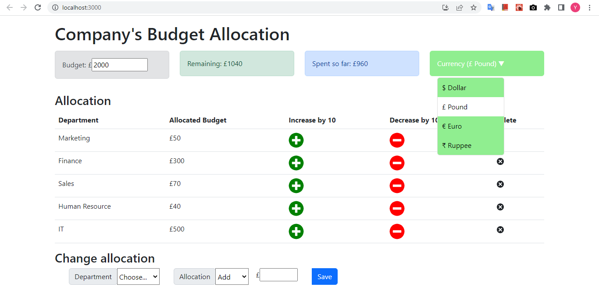

# Budget

## Scenario

You have just joined RKL Insurance company's IT department as a front-end engineer. The company wants you to create an application front end which will allow them to plan for budgeting expenses for various departments.

## Specification

1. Budget allocation validation
- Accepts only numbers in the allocation field
- The number does not exceed remaining budget.

2. Editable budget value
- Editable budget field with increasing and decreasing value by 10
- Does not allow amount lower than amount spent so far
- The upper limit is set to 20,000.

3. Dropdown to change currency
- Has a Currency label in the appropriate place
- Has an editable currency dropdown list
- Has four values $ Dollar, £ Pound, € Euro, ₹ Rupee in the dropdown list, in the specified format
- Has stylized dropdown list (Use image provided for reference).

4. Add a currency prefix to the Change allocation textbox

5. Add a currency prefix to the Budget value textbox

6. Change event of the currency dropdown list
- On change of the dropdown value, all the currency representation on the screen changes.

7. Decrease and Increase Buttons
- An increase button stylized with the image provided should be added for all departments in the allocation. Onclicking the button increases the value by 10
- A decrease button stylized with the image provided should be added for all departments in the allocation. Onclicking the button decreases the value by 10.

## Technology Stack

- JavaScript
- React
- HTML
- CSS, Bootstrap
